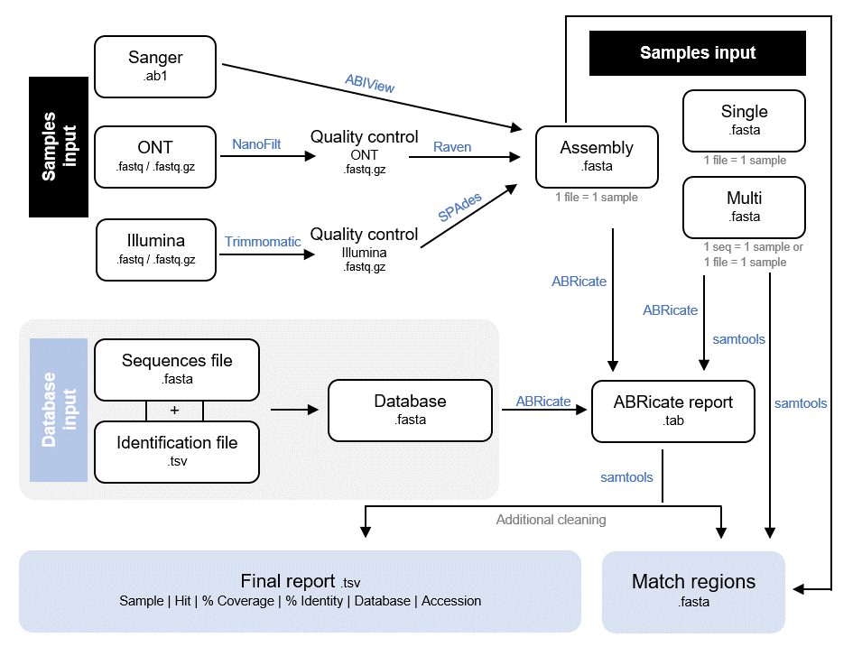

# ReporType

Cruz et al, 2024: https://doi.org/10.3390/ijms25063172

ReporType is an automatic, easy-to-use and flexible pipeline, created with Snakemake, for loci screening and typing. Its application can be particularly useful for rapid genotyping of infectious agents, namely virus and bacteria.

ReporType was designed to accept multiple input formats (from Illumina or ONT reads to Sanger raw files or FASTA files), being suitable for application in a wide variety of pathogens. It relies on multiple software for technology-specific reads QC and de novo assembly, and thus apply ABRicate (https://github.com/tseemann/abricate) for locus screening, culminating in the generation of easy-to-interpret reports towards the identification of pathogen genotypes/subspecies or the screening of loci of interest.

ReporType comes with pre-prepared databases for genotyping of a few virus/bacteria, but can be easily setup to handle custom databases, instructions below. You can also change several analysis parameters, as well as modify parameters of each software used. 




## Main output files

- "ReporType_final_report.tsv" - summary tabular report with the most relevant results, such as sample name, element found (such as genotype, subspecies, etc), coverage and percentage of identity, the database used and accession number (sample | hit | %coverage | %identity | database |accession)

- "detailed" - directory containing the detailed ABRIcate output files for each sample (file | sequence | start | end | strand | gene | coverage | coverage_map | gaps | %coverage | %identity | database | accession | product | resistance). More information about ABRIcate outputs can be consulted in the original GitHub page: https://github.com/tseemann/abricate 
- "intermediate" - directory with all files produced during the workflow (fasta_and_fai_files, trimm_paired_sur_1, trimm_paired_sur_2, trimm_paired_rem_1, trimm_paired_rem_2, spades, trimm_single_sur_1, nanofilt_filtred_files, raven_gfa_files)
- "match_regions" - directory with a fasta file for each input file, containing the match regions found in each sequence
- "logfile.log" - log file with the run date and Snakemake command line for each ReporType execution.


## Installation

- *Installation with **docker***

1. Pull the existing docker imageDownload this git repository<br>
`$ docker pull insapathogenomics/reportype:1.0`

2. Run a container using shared folders eg. (for this example you must provide influenza_seqs.fasta in the /folder_to_share folder): <br>
`$ docker run -it -v /folder_to_share:/app/ReporType/data_shared --rm insapathogenomics/reportype:1.0 ReporType --snakefile  /app/ReporType/snakefile --cores 8 --config sample_directory=/app/ReporType/data_shared/ database=influenza input_format=any multi_fasta=influenza_seqs.fasta output_name=test_influenza output_directory=/app/ReporType/data_shared/output`

3. (alternatively) Run a container interactively:<br>
`$ docker run -it -v /folder_to_share:/app/ReporType/data_shared insapathogenomics/reportype:1.0`<br>
`$ ReporType --snakefile snakefile --cores 8 --config sample_directory=data_shared/ database=influenza input_format=any multi_fasta=influenza_seqs.fasta output_name=test_influenza output_directory=data_shared/output`

If you want to build a docker image from scratch, follow the [instructions here](https://github.com/insapathogenomics/ReporType/tree/main/docker).

- *Installation with **conda***

You need to have  [conda](https://docs.conda.io/projects/conda/en/latest/user-guide/install/index.html) installed.
All the other dependencies will be automatically installed with ReporType.
For installation, you need to:


1. Download this git repository:<br>
`$ git clone https://github.com/insapathogenomics/ReporType`<br>
`$ cd ReporType`

2. Install running:<br>
`$ chmod +x install.sh`<br>
`$ ./install.sh`<br>

### Databases installation

Before installing the databases, it is necessary to activate the conda environment created for ReporType to work. You can activate the environment with the activation command: <br>

`$ alias ReporType='conda activate ReporType && snakemake'; conda activate ReporType`<br>

To install the databases made available together with ReporType, you must execute the following commands:<br>
`$ chmod +x databases_install.sh`<br>
`$ ./databases_install.sh`<br>

To install custom databases, you have two options:<br>

If you have a formated fasta file (```seq~~~id~~~acession```) contaning the database, a new database will be created with the name of the given fasta file:<br>
> **database**: path to fasta file for new database (example: database=path/to/my_database.fasta).<br>

If you don't have a database file already formatated for abricate, you can provide two files to crate a new database:<br>
Note that, in this case, you should write the name of your new database in the "database" variable.
> **fasta_db**: fasta file with the sequences for your database (example: fasta_db=path/to/sequences.fasta).<br>
> **table_db**:  table (tsv) with three columns: column one (sequence), with the name of each sequence; column two (id), with the identification of each element (genotype, subspecies, etc); and column three (accession), with the acession number for each sequence (example table_db=path/to/table.tsv)<br>
> **database**: name of the database you wish to create (example: database=my_database).<br>
Check the "Execution" section for an example of the command to use https://github.com/insapathogenomics/ReporType#example-2---new-database-with-formatted-fasta-file-.

Note that, users should identify the nomenclature level in the name of the database sequences, separated by the character “_” (e.g., “database_type” for sequences defining the influenza A and B “types”, and “database_subtype” for sequences defining the NA or HA subtypes). This flexible function has been tested and integrated for influenza type/subtype/lineage identification. Additional adjustments in the 'table_configuration' script may be required to adapt ReporType to more complex situations. These adjustments must be made in the check_only_type function of the table-configuration.py file, where you can more rigorously define the databases to be considered with more than one nomenclature level.


## Usage

First of all, you need to activate the ReporType environment with the command:<br>
`$ alias ReporType='conda activate ReporType && snakemake'; conda activate ReporType`<br>


Now you must configure your entery params. You have to options, you can open de "config.yaml" file and fill it with your options you configurate them through the command line.<br>

There are some mandatory params for configuration listed below. <br>

**Database input params:** <br>

If you have already install the incorporated databases or created your own: <br>
> **database**: name of the database you wish to use (example: database=my_database).<br>
 
If is the first time using a new database you must follow the instructions mentioned above, creating your own database according to the files you have available, using the params:<br>
> **database**: path or name of the database you wish to create (example: database=path/to/my_database.fasta or database=my_database).<br>
> **fasta_db**: fasta file with the sequences for your database (example: fasta_db=path/to/sequences.fasta).<br>
> **table_db**:  table (tsv) with three columns: column one (sequence), with the name of each sequence; column two (id), with the identification of each element (genotype, subspecies, etc); and column three (accession), with the acession number for each sequence (example table_db=path/to/table.tsv)<br>


**Samples params:** <br>

> **sample_directory**: path to the folder with the samples you wish to analyse. This folder can contain samples from different technologies, as long as they are all analyzed according to the same database (example: sample_directory=path/to/my_samples_folder/).<br>

> **sample_name**: if you wish to analyse only one sample you must give the sample name, you can provide a list of samples (default=all). Note that in paired end sequences, you must give the sample name without any prefixes.<br>

ReporType optional configuration params includes: <br>

> **output_name**: name of your final csv output file (default: output_name=ReporType_final_report)<br>
> **output_directory**: directory for your results (default: output_directory=ReporType_results)<br>
> **input_format**: especify the input format you are going to analyse. If you leave it with the default, all samples of the given folder will be analysed. Your opcions are: fasta,nanopore,illumina_single,illumina_paired,sanger, or any. You must separete them with a coma (default: input_format=any)<br>
> **multi_fasta**: if you are going to analyse any multi-fasta files where each sequence corresponds to one sample, give the name of each multi-fasta file. You can chosse "all" if all of your fasta files are multi-fasta(default: multi_fasta=none).<br>
> **threads**: threads you which to use (default: threads=2).<br>
> **prioritize**: in case there is more than one gene detected for the same feature, choose if you want to prioritize greater coverage (cov) or greater identity (id) (default: prioritize=cov).<br>

You can also specify some software params.<br>

**Abricate params:**<br>

> **minid**: minimum DNA %identity (default: minid=1).<br>
> **mincov**: minimum DNA %coverage (default: mincov=1).<br>

**Illumina params:** (for single and paired reads)<br>
> **illuminaclip_single** and **illuminaclip_paired**: Trimmomatic Illuminaclip, directory of your illumina adapters, as well as specific cleaning informations for your file (default: illuminaclip=ILLUMINACLIP:primers/adapters.fasta:3:30:10:6:true)<br>
> **headcrop_single** and **headcrop_paired**: Trimmomatic Headcrop, cut the specified number of bases from the start of the read (default: headcrop=HEADCROP:0).<br>
> **crop_single** and **crop_paired**: Trimmomatic Crop, cut the read to a specified length by removing bases from the end (default: crop=CROP:400).<br>
> **slidingwindow_single** and **slidingwindow_paired**: Trimmomatic Slidingwindow, minimum average quality established for each sequence according to a certain number of bases (default: slidingwindow=SLIDINGWINDOW:4:15).<br>
> **minlen_single** and **minlen_paired**: Trimmomatic Minlen, minimum read size (default: minlen=MINLEN:36).<br>
> **leading_single** and **leading_paired**: Trimmomatic Leading, bases to remove at the beginning of the read (default: leading=LEADING:3)<br>
> **trailing_single** and **trailing_paired**: Trimmomatic Trailing, bases to remove at the end of the read (default: trailing=TRAILING:3)<br>
> **encoding_single** and **encoding_paired**:Trimmomatic encoding: if quality encoding is not specified in fastq file, specify specify the quality encoding (default=in_file, Your options are: 'phred33', 'phred64')

**Nanopore params:**<br>
> **quality**: Nanofilt minimum quality mean for read (default: quality=8).<br>
> **length**: Nanofilt minimun length per read (default: length=50).<br>
> **maxlength**: Nanofilt maximum length per read (default: maxlength=50000)<br>
> **headcrop**: Nanofilt headcrop, bases to remove at the beginning of the read (default: headcrop=30).<br>
> **tailcrop**: Nanofilt tailcrop, bases to remove at the end of the read (default: tailcrop=30).<br>
> **kmer**: Raven k-mer, length of minimizers used to find overlaps (default: kmer=15). <br>
> **polishing**: Raven polishing-rounds, number of times racon is invoked (default: polishing=2).<br>

**Sanger params:**
> **startbase**: Abiview first sequence base to report or display (default: startbase=20).<br>
> **endbase**: Abiview last sequence base to report or display (default: endbase=800). <br>


The optional configuration params also include all the configuration params for Snakemake, that can be consulted [here](https://snakemake.readthedocs.io/en/v5.1.4/executable.html). The most relevant Snakemake executable params are: <br>
> **--cores**: number of CPU to be used, it is mandatory (example: --cores all).<br>
> **-np**: dry-run to verify the jobs you are submiting. <br>
> **--config**: you must use this command before configurate the ReporType params previosly refered (example: --config database=my_database).<br>
> **--snakefile**: you can execute ReporType in any directory using this command to specify the directory for the snakefile of ReporType (example: --snakefile path/to/ReporType/snakefile).<br> 
> **--configfile**: you can execute ReporType in any directory using this command to specify the directory for the config file of ReporType (example: --configfile path/to/ReporType/config.yaml).<br>


## Execution<br>

ReporType is run through the command line, here are some examples, from the simplest to the most complex.

### Configuration with config.yaml file
If you configurate the config.yaml file, you can only run:<br>
`$ ReporType --cores all `<br>

### Configuration with command line<br>

#### Example 1 - Database already used or previosly installed:<br>
`$ ReporType --cores all --config sample_directory=path/to/my_samples_folder/ database=my_database`<br>

#### Example 2 - New database with formatted fasta file: <br>
##### Example 2.1 - Database creation only: <br>
`$ ReporType --cores all --config database=path/to/my_database.fasta`<br>
##### Example 2.2 - Database creation and running samples: <br>
`$ ReporType --cores all --config sample_directory=path/to/my_samples_folder/ database=path/to/my_database.fasta`<br>

#### Example 3 - New database without formatted fasta file: <br>
##### Example 3.1 - Database creation only: <br>
`$ ReporType --cores all --config database=my_new_database fasta_db=path/to/sequences.fasta table_db=path/to/table.tsv`<br>
##### Example 3.2 - Database creation and running samples: <br>
`$ ReporType --cores all --config sample_directory=path/to/my_samples_folder/ database=my_new_database fasta_db=path/to/sequences.fasta table_db=path/to/table.tsv`<br>

#### Example 4 - Output params configuration: <br>
`$ ReporType --cores all --config sample_directory=path/to/my_samples_folder/ database=my_database output_name=all_samples output_directory=results`<br>

#### Example 5 - Input format params configuration <br>
##### Example 5.1 - You want to analyze all the samples in your folder and you have two multi fasta files:<br>
`$ ReporType --cores all --config sample_directory=path/to/my_samples_folder/ database=my_database input_format=any multi_fasta=multi_fasta_1,multi_fasta_2`<br>

##### Example 5.2 - You want to analyze all fasta files and samples sequenced with nanopore technology, all your fasta files are multi fasta:<br>
`$ ReporType --cores all --config sample_directory=path/to/my_samples_folder/ database=my_database input_format=fasta,nanopore multi_fasta=all`<br>

#### Example 6 - Configuration of some analysis parameters: <br>
`$ ReporType --cores all --config sample_directory=path/to/my_samples_folder/ database=my_database input_format=fasta,nanopore multi_fasta=all minid=1 mincov=1`<br>

#### Example 7 - To execute a dry run:<br>
`$ ReporType -np --config sample_directory=path/to/my_samples_folder/ database=my_database`<br>

#### Example 8 - To run ReporType out of instalation directory:<br>
`$ ReporType --cores all --snakefile path/to/ReporType/snakefile --configfile path/to/ReporType/config.yaml –-config sample_directory=path/to/my_samples_folder/ database=my_database`<br>


<br>
<br>


When you are donne using ReporType you can deactivate the environment with:<br>
`$ conda deactivate`<br>


## Uninstall

To uninstall ReporType, you need to delete the conda environment with: <br>
`$ conda env remove --name ReporType`<br>

## Citation
If you run ReporType, please cite this Github page:<br>

**Cruz H, Pinheiro V, Borges V (2024). ReporType: A Flexible Bioinformatics Tool for Targeted Loci Screening and Typing of Infectious Agents. Int. J. Mol. Sci. 2024, 25(6), 3172** https://doi.org/10.3390/ijms25063172

Also, ReporType relies on the work of other developers. So, depending on the functionalities you use, there are other tools that you must cite: 

1. **ABRicate**: https://github.com/tseemann/abricate
2. **ABIView**: https://emboss.sourceforge.net/apps/cvs/emboss/apps/abiview.html
3. **Trimmomatic**: Bolger AM, Lohse M, Usadel B. Trimmomatic: a flexible trimmer for Illumina sequence data. Bioinformatics. 2014;30:2114–20.
4. **NanoFilt**: De Coster, W., D’Hert, S., Schultz, D. T., Cruts, M., & Van Broeckhoven, C. (2018). NanoPack: visualizing and processing long-read sequencing data. Bioinformatics, 34(15), 2666–2669. https://doi.org/10.1093/bioinformatics/bty149
5. **SPAdes**: Bankevich A, Nurk S, Antipov D, Gurevich AA, Dvorkin M, Kulikov AS, et al. SPAdes: a new genome assembly algorithm and its applications to single-cell sequencing. J Comput Biol. 2012;19:455–77.****
6. **Raven**: Vaser, R., & Šikić, M. (2021). Time- and memory-efficient genome assembly with Raven. Nature Computational Science, 1(5), 332–336.
7. **SAMtools**: Li, H., Handsaker, B., Wysoker, A., Fennell, T., Ruan, J., Homer, N., Marth, G., Abecasis, G., Durbin, R., & 1000 Genome Pro-ject Data Processing Subgroup (2009). The Sequence Alignment/Map format and SAMtools. Bioinformatics (Oxford, Eng-land), 25(16), 2078–2079. 


